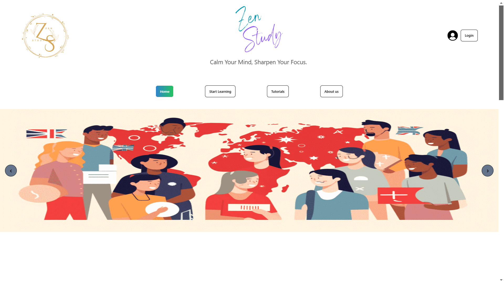

# 📚 Zen Study: A Japanese Vocabulary Learning App  

  

## 🚀 Overview  
**Zen Study** is a web-based language learning application designed to help users learn Japanese vocabulary interactively and efficiently. With features like **interactive lessons, pronunciation practice, vocabulary cards, and progress tracking**, the app provides a fun and engaging learning experience.  

🌐 **Live Demo:** [Zen Study](https://zen-study-3343a.web.app/)  

📂 **GitHub Repository:**  
- [Main Repository](https://github.com/programming-hero-web-course1/b10-a9-authentication-AnantaBG)  
- [Personal Repository](https://github.com/AnantaBG/Zen_Study)  

## 📖 Table of Contents  
- [Features](#-features)  
- [Installation](#-installation)  
- [Usage](#-usage)  
- [Technologies Used](#-technologies-used)  
- [License](#-license)  

---

## ✨ Features  
✅ **User Authentication:** Log in with Google or register a new account via Firebase Authentication.  
✅ **Interactive Lessons:** Learn vocabulary through engaging lessons categorized by difficulty levels.  
✅ **Pronunciation Practice:** Click on words to hear their correct pronunciation.  
✅ **Vocabulary Cards:** Study words with definitions, examples, and usage tips.  
✅ **Progress Tracking:** Track your learning progress and vocabulary growth.  
✅ **Responsive Design:** Works seamlessly on desktop, tablet, and mobile devices.  
✅ **Smooth Animations:** Optional animation effects enhance the user experience.  

---

## ⚙ Installation 

Ensure you have the following installed:  
- **Node.js** (v14 or later)  
- **npm** or **yarn**  
- **Firebase account** for authentication and database

## 🎮 Usage
- **Sign Up / Log In: Use Google authentication or register with an email.**
- **Browse Lessons: Navigate through vocabulary lessons with different difficulty levels.**
- **Practice Pronunciation: Click on words to hear their correct pronunciation.**
- **Review Vocabulary Cards: Study words with definitions, usage examples, and more.**
- **Track Progress: View your progress and see how many words you've mastered.**

## 🛠 Technologies Used
- **Frontend: React, React Router, CSS (or CSS-in-JS)**
- **Backend & Database: Firebase Authentication, Firestore**
- **Hosting: Firebase Hosting**
- **Animations: Framer Motion (optional)**

## 📜 License  
This project is licensed under the **MIT License**.  

📌 **Developed by [AnantaBG](https://github.com/AnantaBG)**  
